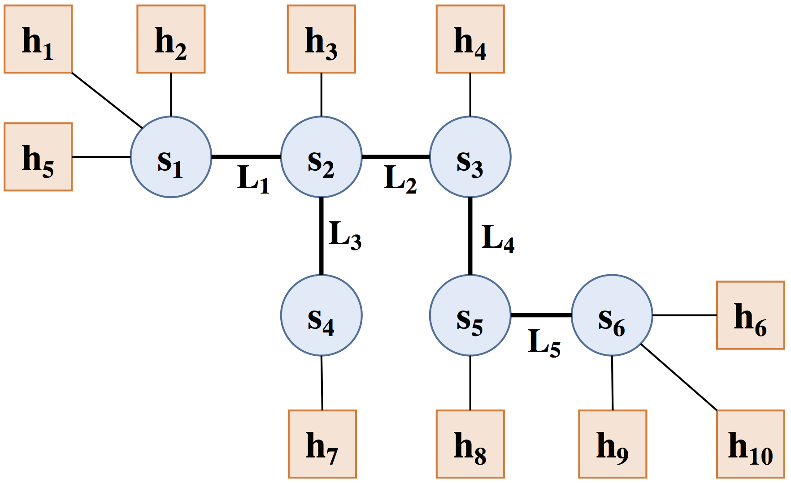

# Project 1: Sockets, Mininet, and Performance

### Due: January 29, 2025 (11:59 PM)

In this project, you will create your own simplified version of [iPerf](https://iperf.fr/), a widely used network measurement tool. This project has the following goals:
- Learn how to set up and use [Mininet](https://mininet.org/), a widely-used network emulation software that enables you to create custom network topologies and test your code all on a single machine. This will be used again in Project 4, and is a useful tool for Projects 2 and 3. 
- Become familiar with programming with Linux [sockets](https://man7.org/linux/man-pages/man2/socket.2.html), which are essential for creating applications that involve network communication and will be used in all four projects. 
- Develop an intuition for and understanding of key network performance characteristics (throughput and latency).
- Become familiar with setting up a VM and using a build system (CMake), which are essential tools for both this class and software development in general. 

This project is divided into the following parts:
* [Part 0](#part0): VM and Dev Environment Setup
* [Part 1](#part1): Mininet Tutorial
* [Part 2](#part2): Custom Mininet Topology
* [Part 3](#part3): `iPerfer`
* [Part 4](#part4): Mininet Measurements

You can find [submission instructions here](#submission-instr). The first two parts are ungraded; the last three have deliverable components. 

<a name="part0"></a>
## Part 0: Setting Up Your VM and Dev Environment

For Projects 1 and 4, you will be using a virtual machine (VM) running Ubuntu Server 24.04. This is because we will be using Mininet (more about this later) to simulate different network topologies. In order to use Mininet, we need certain kernel features, which makes running a virtual machine a necessity.

### Finding a VM Software

We have decided not to prescribe a certain virtual machine for you to use; you may use any VM of your choice. However, in our own experiences, we have found offerings by VMWare to work well. VMWare Workstation (for Windows) and VMWare Fusion Player (for both x86 and ARM Mac) are free for personal use and have worked well for us. However, you need not use them if you have other preferences. 

**At this point in the spec, follow the instructions in `VM_Setup_Guide.pdf` to set up your virtual machine.**

### Development Tips
1. The Autograder is using C++23. Feel free to use whichever C++ features you would like that are included within the standard.
2. We highly recommend that you set up some kind of remote development environment to interact with your virtual machine. This is covered in the setup guide; you can `ssh` into the VM to develop in there from an editor on your local machine. 
3. To initially get your project files into the filesystem of the virtual machine, there are several options:
    1. [Recommended] You can maintain a **private** GitHub repository of all your code and set up a GitHub authentication token in the VM to clone your repository inside the VM. 
    2. You can manually `scp` files from your local machine to the VM, similarly to how you `ssh` into the VM. 

> Note: Copy-pasting from/into the VM can be annoying! Not all VM software reliably supports a shared clipboard. To get around this, we recommend ssh-ing into your VM from your local machine, enabling you to use a local terminal to copy-paste. 

> Note: We encourage you to use GitHub for code versioning and remote backups. Please make sure that any GitHub repository you create for your code in this class is **private**. Creating a public repository with your code, even if by accident, is considered a violation of the Honor Code. If you come across any public GitHub repositories with code for this project, please inform the instructors immediately. 

### CMake and Useful Libraries
One tool that is very common in the real world, but is seldom taught in classes are build systems (of which CMake is one). Build systems allow you to declaratively specify what programs can be built, and what dependencies each program has within a codebase.

For this project, you will be using CMake to build `iPerfer`. You will be using in external dependencies to both make your life easier, and to get used to working with other people's code. These dependencies are:
1. `cxxopts`: No one likes dealing with `getopt.h`. `cxxopts` allows you to easily define and use command line arguments for your program.
2. `spdlog`: Good logging is essential for real world programs. `spdlog` is a logging library that makes this easier. The library provides several levels of logging; the three most commonly used levels are `error`, `info`, and `debug`. Setting a certain logging level prints all messages at that level or lower (e.g. `error` is the lowest and `debug` is the highest here). 

To show the value of these tools, imagine accepting an server/client config and port as arguments, and then logging that you're listening/sending to that port. With these tools, it's as simple as:

```
    cxxopts::Options options("iPerfer", "A simple network performance measurement tool");
    options.add_options()
        ("s, server", "Enable server", cxxopts::value<bool>())
        ("p, port", "Port number to use", cxxopts::value<int>());

    auto result = options.parse(argc, argv);

    auto is_server = result["server"].as<bool>();
    auto port = result["port"].as<int>();

    spdlog::debug("About to check port number...")
    if (port < 1024 || port > 0xFFFF) {
      spdlog::error("Port number should be in interval [1024, 65535]; instead received {}", port); 
      return; 
    }

    spdlog::info("Setup complete! Server mode: {}. Listening/sending to port {}", is_server, port);
```
As you can see, you can easily and cleanly combine error, debugging, and informational messages in your program. You can set the global logging level using
```
spdlog::set_level(spdlog::level::debug); 
```
You may change the level depending on how much output you are interested in seeing. 

You are highly encouraged to use both `cxxopts` and `spdlog` to make your programs bug-free and easy to read. If you have other favorite tools that perform the same purpose, feel free to use those; however, the course staff will likely not be familiar with them and may not be able to help you. Please do not try to write your own command line input parser or use native `cout` statments for logging; we reserve the right to refuse to debug code that follows these [anti-patterns](https://en.wikipedia.org/wiki/Anti-pattern). 

<a name="part1"></a>
## Part 1: Mininet Tutorial

Before you write or test `iPerfer`, you will learn how to use Mininet to create virtual networks and run simple experiments. According to the [Mininet website](http://mininet.org/), *Mininet creates a realistic virtual network, running real kernel, switch and application code, on a single machine (VM or native), in seconds, with a single command.* We will use Mininet in programming assignments throughout the semester. You should have installed Mininet as part of your VM setup in the previous part. 

### Mininet Walkthrough

Once you have access to Mininet, you should complete the following sections of the standard [Mininet walkthrough](http://mininet.org/walkthrough/):

* All of Part 1, except the section "Start Wireshark"
* The first four sections of Part 2—"Run a Regression Test", "Changing Topology Size and Type", "Link variations", and "Adjustable Verbosity"
* All of Part 3

At some points, the walkthrough will talk about software-defined networking (SDN) and OpenFlow. We will discuss these during the second half of the semester, so you do not need to understand what they mean right now; you just need to know how to run and interact with Mininet. We will review using Mininet in discussion as well.

> NOTE: You do not need to submit anything for this part of the assignment. This portion is meant to help your understanding for this and future assignments.

### Useful Mininet Commands
Below we've compiled a list of useful Mininet commands. Please refer to the official [Mininet documentation](mininet.org) for more information. These are also covered in the walkthrough. 

To launch Mininet with the standard topology, simply run
```
$ sudo mn
```
Note that Mininet must always run as root (i.e. using `sudo`). You can also launch Mininet using the Python API; an example of this is found in the `util/topology.py` file and more information can be found online. To launch Mininet with the Project 1 topology, you can run 
```
$ sudo python3 util/topology.py
```
assuming you are currently in the root directory of the project. 

Once you have launched Mininet, you will be inside the Mininet CLI. Your command line prompt should look like
```
mininet>
```
Here are some useful commands inside the Mininet CLI:
```
$ nodes       // shows all current nodes in the network
$ dump        // shows all info about current topology
$ net         // shows all network interfaces
$ h1 ping h2  // run the [ping h2] command on h1
$ h1 bash     // enter a terminal inside h1
```
Once you run something like `$ h1 bash`, you will have a terminal inside of the emulated machine that is Host 1. You can then run any commands that Host 1 could run. In Mininet, all hosts have a shared filesystem. If you forget which host you are in, you can always run `ifconfig` to check your own IP address. Note that, within the host terminals, Mininet will not automatically replace other host names with their IP addresses; so something like 
```
$ ping h2         // NOTE: Inside h1 terminal
```
will not work, but 
```
$ ping 10.0.0.2   // NOTE: Inside h1 terminal
```
will work!

If Mininet ever crashes or acts strange, use the following command to clean up Mininet before restarting it:
```
$ sudo mn -c
```

### General Shell Tips with Mininet
The following shell tips may be useful over the course of this project:

- Use `>` to redirect output to a file. The following code will print the results
  of pinging h2 from h1 into `ping_h1_h2.txt`. 
  ```
  $ h1 ping -c 5 10.0.0.2 > ping_h1_h2.txt
  ```
- Use `&` to run a process in a non-blocking way by spawning a new thread in the
  background. The following code will do the exact same thing as the code above, 
  except you will be able to run another command while the first one is running.
  ```
  $ h1 ping -c 5 10.0.0.2 > ping_h1_h2.txt &
  ``` 
- Using `&` will typically cause the PID (process ID) of the background process
  to be printed out. You can kill the process using this PID to make it stop 
  using the following command:
  ```
  kill -9 [PID]
  ```

### Running Multiple Hosts at Once in Mininet
Over the course of this assignment (and especially in Part 3) you may want to run 
programs in multiple hosts at once using Mininet (e.g. to run a client in one
host and a server in another). Normally, if you are running a Linux machine with an actual display, 
you can do something like `xterm h1 h2` to have separate terminals pop up for Host 1 and Host 2. Unfortunately, 
when using a VM, this is a bit tricker. There are several alternate approaches you can take to run programs on multiple hosts concurrently:

#### Option 1: Use mnbash (Recommended)
To solve this problem, we've developed an `mnbash` command that you can use to run commands on multiple hosts.
To use this, first run the following commands:
```
$ sudo cp util/mnbash /usr/bin/mnbash
$ sudo chmod +x /usr/bin/mnbash
```
This is a one-time setup; once you run these once on your VM, `mnbash` should always work. 

To use this functionality, first ensure a Mininet topology is running (e.g. by running `sudo mn`) in your Linux VM. 
Now, you can `ssh` multiple times into the Linux VM (once for each host you want to run something on) and run something like
```
$ mnbash h1
```
to open up a terminal for Host 1 in one of the terminals; similarly, you can run `$ mnbash h2` in another terminal at the same time, 
and now you can easily run commands in multiple hosts at once!

> Note: For the curious, each Mininet host is simply a different process running concurrently on one machine. This enables the shared filesystem; the illusion of these machines being separated by a network is created by having each process have a different network namespace. We take advantage of this to find the PID of a particular host in the `mnbash` script and open a terminal into that host. 

#### Option 2: Use Python API (Optional but fun!)
As you may have seen in `util/topology.py`, Mininet provides a Python API that makes it convenient and easy to run commands on 
Mininet hosts directly from a Python script. Here are a few links to supplement your understanding of the Mininet Python API:

- https://github.com/mininet/mininet/wiki/Introduction-to-Mininet#running
- https://mininet.org/api/classmininet_1_1net_1_1Mininet.html
- https://mininet.org/walkthrough/#part-4-python-api-examples

A good starting point is to open up `util/topology.py`. In the main function, after `net.start()`, you can input the following lines of code:

```
h1 = net.get('h1')
h1.cmd('ping -c 5 10.0.0.2 > latency.txt')
```

Try it out and see what happens! You can use the Python API to make some of your measurement code in Part 4 easier; it can also make the process
easily replicable, so you don't have to type in the same commands over and over again into your terminal if you mess up. 

#### Option 3: Use background processes to do it natively (Painful)
The naive way to do this using just one terminal is to run commands in hosts as background processes (using `&` in the shell), allowing you to 
run multiple processes at once from a single shell. This becomes tedious and unweildy very quickly, and we do not recommend it. 

<a name="part2"></a>
## Part 2: Create a Custom Mininet Topology

To familiarize yourself more with Mininet topologies, write Python script to create a custom network topology in Mininet that has at least 5 hosts and 5 switches. You might find looking into the source code for `util/topology.py` particularly helpful; this script creates a network with the following topology:



Once you've written the script, create a visualization of your custom topology (using circles to denote switches and squares to represent hosts). You may either use illustration software (Google Drawings, Typst, Latex all work well) or draw this by hand, as long as the diagram is clear. The diagram should label each host and switch with the same name that you assign it in your Python script. 

These deliverables should be stored in a `topology` folder at the top-level of your repository, named `<uniqname>_topology.py` and `<uniqname>_topology.png`. You can find further [submission instructions here](#submission-instr). 

<a name="part3"></a>
## Part 3: Write `iPerfer`

In this portion of the assignment, you will write your own version of `iPerf` to estimate the throughput between two hosts. Your tool, called `iPerfer`, will send and receive TCP packets between a pair of hosts using TCP sockets.

> **NOTE:** You may refer to [Beej's Guide to Network Programming Using Internet Sockets](https://beej.us/guide/bgnet/html/) for socket programming. Discussion sections will also review the some of the basics.

`iPerfer` can run in either *client mode* or *server mode*. 

When operating in client mode, `iPerfer` will send TCP packets to a specific host (i.e. the `iPerfer` server) for a specified time window and track how much data was sent during that time frame. Using this data, it will calculate and display the estimated bandwidth based on how much data was sent in the elapsed time. 

When operating in server mode, `iPerfer` will receive TCP packets (from the `iPerfer` client) and track how much data was received during the lifetime of a connection; it will calculate and display the estimated bandwidth based on how much data was received and how much time elapsed during the connection.

> **NOTE:** When measuring time, we highly recommend using `std::chrono::high_resolution_clock` for checking and computing passed time. From here, you can cast the time into microseconds for more accurate time keeping.

### Background: Measuring Bandwidth
When a packet is sent on a link from Host A to Host B, the total time that the packet takes is given by the Propagation Delay + Transmission Delay. Note we are ignoring any processing or queuing delays. The propagation delay is also called the latency, and measures the amount of time it takes a single unit of data to travel the length of the link. The transmission delay measures how long it takes to push all bytes of the packet onto the link; this is determined by the bandwidth. Specifically, the transmission delay is given by

$$\text{Transmission Delay} = \frac{\text{Data Size}}{\text{Bandwidth}}.$$ 

For instance, if you are sending 25 Mb (megabits, notice the lowercase "b") of data over a 5 Mbps (megabits per second) link, the transmission delay is $25 Mb/5 Mbps = 5s$. We can rearrange this equation to find that 

$$\text{Bandwidth} = \frac{\text{Data Size}}{\text{Transmission Delay}}.$$

We cannot directly measure the transmission delay. However, we can measure the total time taken to send a large packet and receive a small acknowledgement (ACK) back. As the transmission delay for the ACK is negligible, the total time elapsed from starting to send the initial packet to receiving the ACK is

$$\text{Total Time} = \text{Transmission Delay} + \text{Forward Propagation Delay} + \text{Backward Propagation Delay}.$$ 

The two propagation delays added together is also called the Roundtrip Time (RTT), and is easy to measure! We simply send a small packet and receive a small response; as the transmission delays are negligible (due to small data size), this time is dominated by the propagation delays, and estimates the RTT. Once we have this estimate of the RTT, we can use it to calculate the transmission delay. We will use this principle to estimate the bandwidth in iPerfer. 

### Setup

To setup the build system, you must complete the `CMakeLists.txt` files under the `cpp/` directory. We have already completed `cpp/CMakeLists.txt` for you. You should fill in `cpp/src/CMakeLists.txt` to compile a program called `iPerfer`. We have included the code to link the external dependencies as a comment in this file.The basics section of ["An Introduction to Modern CMake"](https://cliutils.gitlab.io/modern-cmake/chapters/basics.html) should be more than sufficient to get you through this part. 

To build your CMake program, you *can* use the command line, but we recommend that you use IDE tools instead. For VSCode, this is pretty easy. Simply install the "CMake Tools" extension. Then, open the command pallette, and run "CMake: Configure" (select "Unspecified" if it asks you what kit to use). This will let you get Intellisense (autocomplete) on external dependencies. Then, to run the program, in the command pallette, hit "CMake: Build". This will build your project, creating an executable in the `build/bin/` directory. 

If you would rather use the command line, follow these steps:
```
$ mkdir build
$ cd build
$ cmake ../cpp/
$ make
$ ./bin/iPerfer
```

### Overview
iPerfer will be able to operate in two modes: server mode and client mode. The workflow is the following:

1. An `iPerfer` server is running. 
2. An `iPerfer` client connects to an `iPerfer` server using TCP. 
3. Loop 8 times:
    1. The `iPerfer` client sends a small (1-byte) message to the `iPerfer` server (these should be the character 'M' (77)). 
    2. The `iPerfer` server responds with a small (1-byte) message to the `iPerfer` client (these should be the character 'A' (65)). 
    3. The `iPerfer` client and server both measure the RTT. 
4. Estimate the RTT based on the last **four** RTT measurements on both the server and client (we exclude initial measurements due to potential delays due to one-time warm-up costs). 
5. Loop until a given time period (specified on the command line) elapses:
    1. The client transmits 80KB of data to the server. This should be all 0s -- this is the character '\0' (0), not '0' (48). 
    2. The server responds with a small (1-byte) ACK message to the client (this should be the character 'A' (65)). 
6. The client and the server independently calculate the estimated throughput based on this transmission. 
    1. The client should use the time elapsed from when it begins sending the first byte of data to reception of the last acknowledgement to estimate throughput. 
    2. The server should use the time elapsed from when it receives the first byte of data to the sending of the last acknowledgement message to estimate throughput. 

> **Note:** The server and the client may not agree on the estimated throughput, as they will have slightly different ideas about how much time has elapsed. However, both the server and the client should report the exact same number of bytes transmitted. 

### Server Mode

To operate `iPerfer` in server mode, it should be invoked as follows:

`$ ./iPerfer -s -p <listen_port>`

* `-s` indicates this is the `iPerfer` server which should consume data
* `listen_port` is the port on which the host is waiting to consume data; the port should be in the range `1024 ≤ listen_port ≤ 65535`

You can use the presence of the `-s` option to determine `iPerfer` should operate in server mode.

If arguments are missing or extra arguments are provided, you should exit with a non-zero error code.

If the server port argument is less than 1024 or greater than 65535, you should print the following as exactly specified using the `error` level of `spdlog` (with a newline after it) and exit with status code 1:

`Error: port number must be in the range of [1024, 65535]`

When running as a server, `iPerfer` must use the `info` level of `spdlog` to print `iPerfer server started` after it has started listening for TCP connections from a client. When a client connects, the server must print `Client connected` at the `info` level. 

The server should respond to the first eight (1-byte) packets with 1-byte ACK packets. It should estimate RTT by measuring time elapsed between the sending of each ACK and the reception of the subsequent client packet. Note that this means the server will have seven measurements instead of eight. 

After the client has closed the connection, `iPerfer` server must print a one-line summary in the following format using the `info` level of `spdlog`:

`Received=X KB, Rate=Y Mbps, RTT=Z ms`

where X stands for the total number of bytes received (in kilobytes), Y stands for the rate at which traffic could be read in megabits per second (Mbps), and Z stands for the estimated RTT (in milliseconds). Note X and Z should be integers and Y should be a decimal with **three digits** after the decimal mark (e.g. `spdlog::info("{:.3f}", my_num)`). There are no characters after the `ms`, but there should be a newline.

For example:
`Received=6543 KB, Rate=5.234 Mbps, RTT=20ms`

The `iPerfer` server should shut down gracefully after it handles one connection from a client.

> **Note:** Please use `setsockopt` to allow reuse of the port number, this will make your life easier for testing and will allow you to pass the autograder, which runs the `iPerfer` server with the same port number each time. 

### Client Mode

To operate `iPerfer` in client mode, it should be invoked as follows:

`$ ./iPerfer -c -h <server_hostname> -p <server_port> -t <time>`

* `-c` indicates this is the `iPerfer` client which should generate data
* `server_hostname` is the hostname or IP address of the `iPerfer` server which will consume data
* `server_port` is the port on which the remote host is waiting to consume data; the port should be in the range 1024 ≤ `server_port` ≤ 65535
* `time` is the duration in seconds for which data should be generated. This may be an integer or a decimal. You should use `cxxopts` and `std::chrono` to account for this.

If any arguments are missing or extra arguments are provided, you should exit with a non-zero status code. 

If the server port argument is less than 1024 or greater than 65535, you should print the following as exactly specified using the `error` level of `spdlog` (with a newline after it) and exit with status code 1:

`Error: port number must be in the range of [1024, 65535]`

If the time argument ends up parsing to less than or equal to 0, you should print the following as exactly specified using the `error` level of `spdlog` (with a newline after it) and exit with status code 1:

`Error: time argument must be greater than 0`

If both the port and time argument are invalid, print only the port error message.

When running as a client, `iPerfer` should first send the eight 1-byte packets to the server to estimate RTT, waiting for an ACK between each one. Once the RTT has been estimated, the client should start sending data for the duration specified by the `time` argument (note that the RTT estimation phase should not count as part of the time). 

Data should be sent in chunks of 80KB and the data should be all zeros (note: this is the char `'\0'`, not the char `'0'`). Keep a running total of the number of bytes sent. After each 80KB chunk is sent, the client should wait for a 1-byte ACK from the server before sending the next chunk. 

`iPerfer` client must log a one-line summary using `spdlog::info` in the following format:

`Sent=X KB, Rate=Y Mbps, RTT=Z ms`

where X stands for the total number of bytes received (in kilobytes), Y stands for the rate at which traffic could be read in megabits per second (Mbps), and Z stands for the estimated RTT (in milliseconds). Note X and Z should be integers and Y should be a decimal with **three digits** after the decimal mark (e.g. `spdlog::info("{:.3f}", my_num)`). There are no characters after the `ms`, but there should be a newline.

For example:
`Sent=6543 KB, Rate=5.234 Mbps, RTT=20ms`

> **NOTE:** When calculating the rate, **do not** use the `time` argument, rather measure the time elapsed from when the client first starts sending data to when it receives its acknowledgement message. Additionally, note that the throughput is in Kilobytes (KB) whereas the rate is in Megabits per second. (Mbps) Make sure your units are accurate to avoid losing points on the autograder.

### Testing

You can test `iPerfer` on any machines you have access to. However, be aware the certain ports may be blocked by firewalls on end hosts or in the network, so you may not be able to test your program on all hosts or in all networks.

The primary mode for testing should be using Mininet. You should complete [Part 1](#part1) of this assignment before attempting that.

The autograder will be released about halfway through the assignment. Instructions for submission are [here](#submission-instr). It is not meant to be your primary source of testing/debugging, but is rather intended for you to see your overall progress. You are free to use `spdlog::debug` to output debug logs, but you should not output any `error` or `info` logs not specified in this specification. 

### Tips

1. A capital 'B' refers to bytes; a lowercase 'b' refers to bits. For instance, $5 MB = 40 Mb$, as 1 byte = 8 bits. Due to convention, network bandwidth is usually measured in some sort of bits-per-second (e.g. megabits per second, gigabits per second). On the other hand, data size is typically measured in bytes (e.g. megabytes, kilobytes). 
2. The prefixes *kilo*, *mega*, and *giga* refer to base-10 prefixes; to refer to base-2 prefixes, we would use *kibi*, *mebi*, *gibi*. 
3. Pay attention to socket code! The send function does not necessarily send everything you ask it to; see the discussion code and the man page for details. 
4. If you test your code on networks that have bandwidth/latency varying too much from the Mininet defaults (on the order of 10s of Mbps and 10s of ms of latency), 
your bandwidth estimate may not be as accurate. 

### FAQ
1. **Why don't we need to worry about dropped packets here?** Dropped packets are not a concern because we are using TCP sockets, which takes care of reliable, in-order packet delivery for us. We will learn how to implement our own reliable transport protocol in Project 3!
2. [This section will be updated as questions arise]

<a name="part4"></a>
## Part 4: Measurements in Mininet

For the fourth part of the assignment you will use the tool you wrote (`iPerfer`) and the standard latency measurement tool `ping`, to estimate the bandwidth and latency in a virtual network in Mininet. Read the `ping` man page to learn how to use it. Note that `ping` measures RTT, not one-way latency; to make things easier in this section, we will always report RTT instead of latency. 

> Note: If you are not confident your `iPerfer` is working correctly, feel free to use `iPerf` for measurements instead for this section. Output from either will be accepted. 

You must include the output from some of your experiments and the answers to the questions below in your submission, both in the Autograder and in Gradescope. Include answers to the questions in the provided `measurement/answers.txt` file. Do not modify the structure in any way; simply fill in the blanks and the explanations. 

To run Mininet with the provided topology, run the Python script `util/topology.py`:

```
sudo python3 util/topology.py
```

This will create a network with the following topology:


Hosts (`h1` to `h10`) are represented by squares and switches (`s1` to `s6`) are represented by circles; the names in the diagram match the names of hosts and switches in Mininet. The hosts are assigned IP addresses 10.0.0.1 through 10.0.0.10; the last number in the IP address matches the host number.

### Q1: Link Latency and Throughput
First, you should measure the RTT and bandwidth of each of the five individual links between switches (`L1` - `L5`). You should run ping with 20 packets and store the output of the measurement on each link in a file called `latency_L#.txt`, replacing # with the link number from the topology diagram above. You should run `iPerfer` for 20 seconds and store the output of the measurement on each link in a file called `throughput_L#.txt`, replacing # with the link number from the topology diagram above. These should be stored under the `measurement/Q1/` directory. 

### Q2: Path Latency and Throughput
Now, assume `h1` wants to communicate with `h10`. What is the expected RTT and throughput of the path between the hosts? Put your prediction in the `answers.txt` file under Q2.

Measure the RTT and throughput between `h1` and `h10` using `ping` and `iPerfer`. It does not matter which host is the client and which is the server. Use the same parameters as above (20 packets / 20 seconds) and store the output in files called `measurement/Q2/latency.txt` and `measurement/Q2/throughput.txt`. Put the average RTT and measured throughput in the `answers.txt` file and explain the results. If your prediction was wrong, explain why.

### Q3: Effects of Multiplexing
Next, assume multiple hosts connected to `s1` want to simultaneously talk to hosts connected to `s6`. What is the expected RTT and throughput when two pairs of hosts are communicating simultaneously? Put your predictions in your `answers.txt` file under question 3.1.

Use `ping` and `iPerfer` to measure the RTT and throughput when there are two pairs of hosts communicating simultaneously; it does not matter which pairs of hosts are communicating as long as one is connected to `s1` and one is connected to `s6`. Use the same parameters as above. You do not need to submit the raw output, but you should put the average RTT and measured throughput for each pair in your `answers.txt` file under question 3.1 and explain the results. If your prediction was wrong, explain why.

Repeat for three pairs of hosts communicating simultaneously and put your answers in `answers.txt` under question 3.2. 

Do not worry too much about starting the clients at the exact same time. As long as the connections overlap significantly, you should achieve the correct results. You can achieve approximately simultaneous testing while using iPerfer by starting the servers first, and having client commands prepared that you can paste quickly into your terminal(s). 

### Q4: Effects of Latency
Lastly, assume `h1` wants to communicate with `h10` at the same time `h3` wants to communicate with `h8`. What is the expected RTT and throughput for each pair? Put your prediction in your `answers.txt` file under question 4.

Use `ping` and `iPerfer` to conduct measurements, storing the output in files called `latency_h1-h10.txt`, `latency_h3-h8.txt`, `throughput_h1-h10.txt`, and `throughput_h3-h8.txt`. Put the average RTT and measured throughput in your `answers.txt` file and explain the results. If your prediction was wrong, explain why.

<a name="submission-instr"></a>
## Submission Instructions

Your submission will be in two parts; the first part will be submitted to the Autograder [here](https://g489.eecs.umich.edu/). The second part will be submitted to [Gradescope](https://gradescope.com); you should have already been added to an EECS 489 class here. 

### Directory Structure
Your final directory structure should look like this:
```
cpp/
    CMakeLists.txt
    src/
        CMakeLists.txt
        ** code file(s) **
util/
    create_submission.sh
    mnbash
    topology.py
    ** any additional scripts you use **
topology/
    <uniqname>_topology.png
    <uniqname>_topology.py
measurement/
    answers.txt
    Q1/
        latency_L1.txt
        latency_L2.txt
        latency_L3.txt
        latency_L4.txt
        latency_L5.txt
        throughput_L1.txt
        throughput_L2.txt
        throughput_L3.txt
        throughput_L4.txt
        throughput_L5.txt
    Q2/
        latency.txt
        throughput.txt
    Q4/
        latency_h1_h10.txt
        throughput_h1_h10.txt
        latency_h3_h8.txt
        throughput_h3_h8.txt
```

### Autograder Submission
To submit, run 
```
util/create_submission.sh . 
```
from the root of your project repository. This will create a `submit.tar` file that you can submit to the Autograder. If you encounter a permission denied error, make sure that the script has execution privileges by running `$ sudo chmod +x util/create_submission.sh`. 

You are allowed three submissions per day. **There are no late days for Project 1**. 

Ensure that when you run CMake and build all of the targets, your CMake configuration outputs a single program named `iPerfer` to the `build/bin` directory (located at the root-level of your project). 

### Gradescope Submission
Submit a PDF to Gradescope that contains:
1. The diagram of your custom topology
2. The Python script to run your custom topology (this can be an image, but it should be easily readable). 
3. Answers copy-pasted from `answers.txt`. 

The deadline for Gradescope submission is the same as the Autograder deadline. 

## Acknowledgements
This programming assignment is based on Aditya Akella's Assignment 1 from Wisconsin CS 640: Computer Networks and has been modified by several years of previous EECS 489 staff. 
